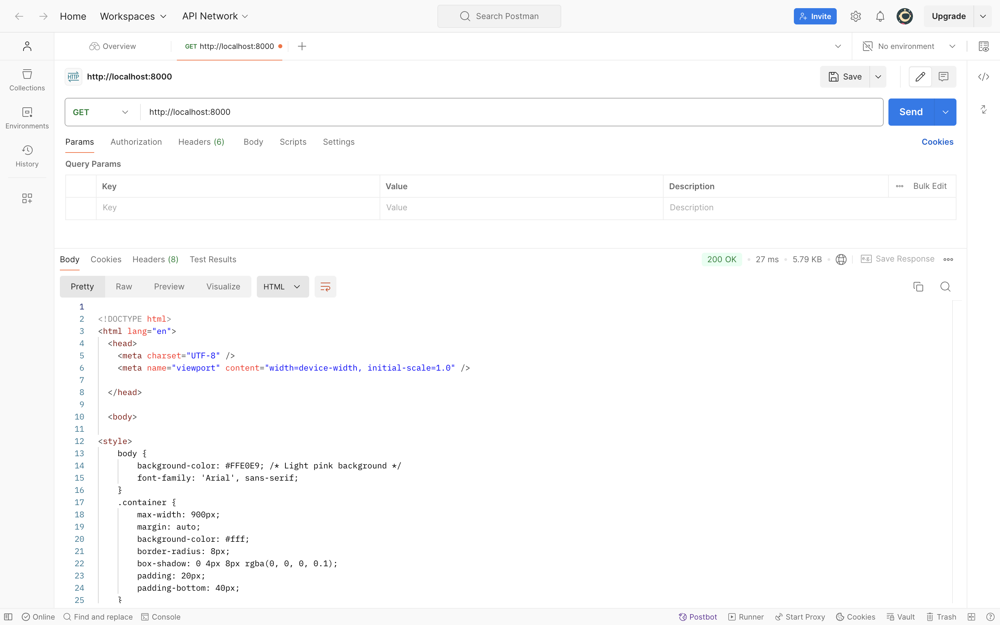
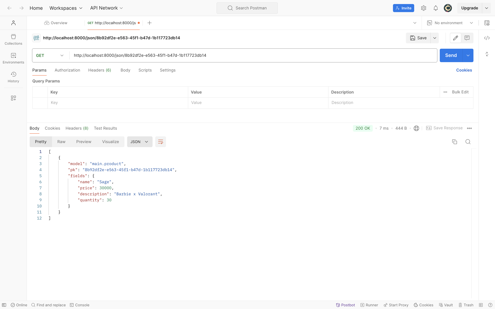
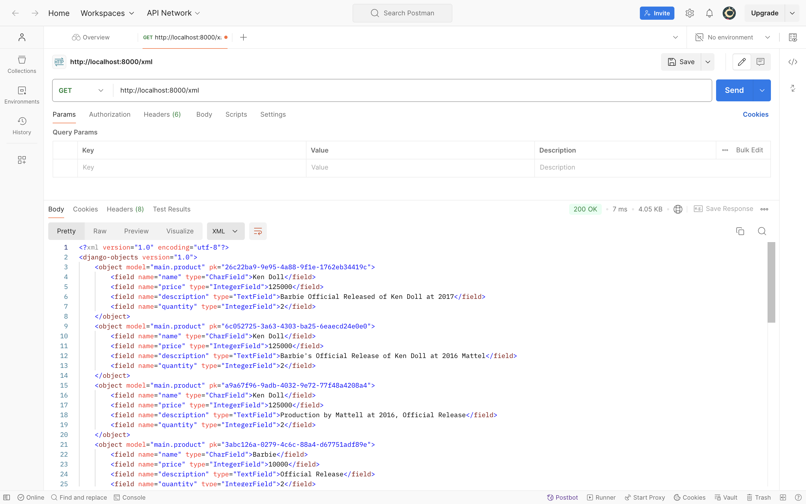
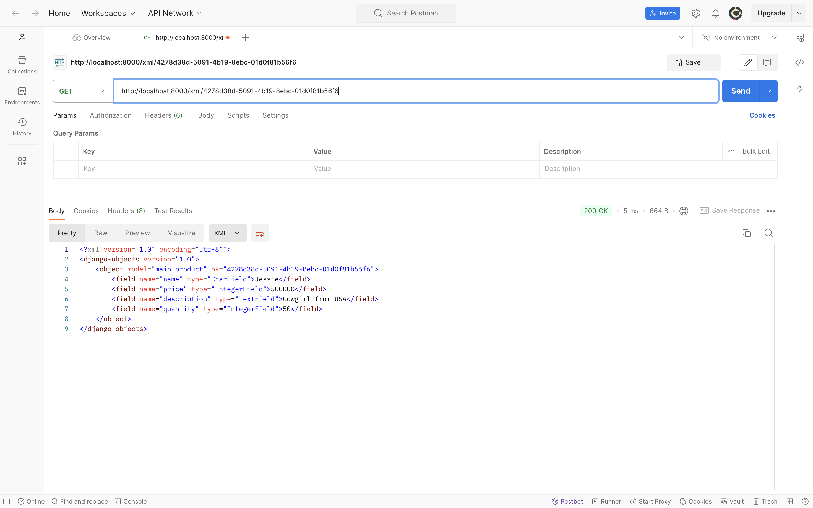

# Welcome to Mojo Dojo Casa House 🕺🏻💃🏻


## Tugas 2
<details>

### Cara _Step by Step_ Mengimplementasikan _Checklist_ 
1. Membuat repositori baru dengan nama ```Mojo Dojo Casa House```.
2. Menghubungkan repositori lokal dengan repositori di GitHub.
3. Melakukan _cloning_ repositori tersebut ke komputer lokal.
4. Membuat _virtual environment_ Python dengan perintah:
    ```bash
    python3 -m venv env
    ```
5. Mengaktifkan _virtual environment_ Python baru dengan perintah:
    ```bash
    source env/bin/activate
    ```
6. Membuat file ```requirements.txt``` dengan menambahkan beberapa _depedencies_.
    ```
    django
    gunicorn
    whitenoise
    psycopg2-binary
    requests
    urllib3
    ```
7. Menginstalasi _dependencies_ dengan pip.
    ```bash
    pip install -r requirements.txt
    ```
8. Membuat proyek Django baru dengan perintah:
    ```bash
    django-admin startproject mojo_dojo_casa_house .
    ```
9. Mengubah ```ALLOWED_HOSTS``` di ```settings.py``` untuk keperluan deployment pada direktori ```mojo_dojo_casa_house```.
    ```bash
    ...
    ALLOWED_HOSTS = ["localhost", "127.0.0.1"]
    ...
    ```
10. Membuat aplikasi baru dengan nama ```main``` dengan perintah:
    ```python
    python manage.py startapp main
    ```
11. Mendaftarkan aplikasi ```main``` ke dalam ```settings.py```
    ```
    INSTALLED_APPS = [
    ...,
    'main'
    ]
    ```
12. Mengisi berkas ```models.py``` pada direktori aplikasi ```main``` dengan kode:
    ```python
    from django.db import models

    class Product(models.Model):
        name = models.CharField(max_length=255)
        price = models.IntegerField()
        description = models.TextField()
        quantity = models.IntegerField()
    ```
13. Melakukan migrasi dengan perintah:
    ```python
    python manage.py makemigrations
    python manage.py migrate
    ```
14. Membuat direktori template dan template ```main.html```. 
    ```html
    <h1>Mojo Dojo Casa House 🕺🏻💃🏻</h1>

    <h3>Welcome to our online shop! </h3>
    <p>Username: {{ name }}</p>
    <p>Class: {{ class }}</p>
    ```
15. Menambahkan fungsi pada berkas ```views.py```:
    ```python
    from django.shortcuts import render

    def show_main(request):
        context = {
            'name' : 'Joanne',
            'class' : 'PBP C'
        }

        return render(request, "main.html", context)
    ```
16. Melakukan _routing_ URL di dalam direktori ```main``` dengan membuat berkas ```urls.py``` yang isinya:
    ```python
    from django.urls import path
    from main.views import show_main

    app_name = 'main'

    urlpatterns = [
        path('', show_main, name='show_main'),
    ]
    ```
17. Melakukan tes aplikasi pada localhost dengan perintah:
    ```python
    python3 manage.py runserver
    ```
18. Membuka ```http://localhost:8000``` untuk melihat aplikasi pada _browser_
19. Melakukan _deploy app_ ke situs Pacil Web Server (PWS)

### Bagan _Request Client_ ke _Web_ Aplikasi berbasis Django


_Request_ dari pengguna akan diproses terlebih dahulu sebelum diteruskan ke View yang tepat. View tersebut kemudian akan mengakses atau memodifikasi data di Model dan menggunakan Template untuk menampilkan dan mengirimkan respons kembali ke pengguna.

### Fungsi ```git``` dalam Pengembangan Perangkat Lunak
1. Mencatat semua perubahan kode, memungkinkan _developer_ melihat riwayat modifikasi dan siapa yang melakukan perubahan.
2. Memungkinkan banyak _developer_ bekerja secara bersamaan di cabang berbeda tanpa konflik, dengan kemampuan menggabungkan hasil kerja menggunakan _merge_.
3. Memfasilitasi pengelolaan versi perangkat lunak sehingga pengembang dapat beralih antar versi atau mengembalikan kode ke versi sebelumnya.
4. Menyimpan proyek dalam repositori yang dapat diakses lokal atau melalui server, seperti GitHub, untuk pembaruan atau pengunduhan kode.
5. Mendukung integrasi berkelanjutan dengan memudahkan ```pull```, ```commit```, dan ```push``` perubahan serta pengujian otomatis.

### Alasan Mengapa Framework Django Dijadikan Permulaan Pembelajaran PengembanganPperangkat Lunak
1. Tersedia banyak fitur bawaan sehingga pemula bisa langsung fokus pada pengembangan (seperti autentikasi, routing URL, dan pengelolaan database).
2. Terdapat pola arsitektur _Model View Template_ (MVT) yang memudahkan pemahaman pemisahan logika, tampilan, dan data.
3. Memiliki dokumentasi lengkap yang mudah diikuti oleh pemula.
4. Mendorong _clean code writing_ yang terstruktur, membantu membangun kebiasaan pengembangan yang baik.
5. Memiliki banyak pengguna dan komunitas sehingga dapat mendukung pemula dalam belajar dan menemukan solusi.

### Alasan Model pada Django disebut ORM
Disebut sebagai _Object-Relational Mapping_ (ORM) karena ORM memungkinkan kita untuk menghubungkan objek Python dengan tabel di database. Dengan ORM, kita dapat membuat, membaca, memperbarui, dan menghapus data di database tanpa menulis _query_ SQL secara langsung. 

Misalnya, setiap model di Django mewakili tabel dalam _database_, dan setiap atribut model mewakili kolom dalam tabel tersebut. ORM juga memudahkan pengelolaan relasi antar tabel dan perubahan skema database dengan sistem migrasi otomatis.
</details>

## Tugas 3
<details>

### Alasan Mengapa Kita Perlu Data Delivery dalam Pengimplementasian sebuah _Platform_
1. Menjamin data yang dikirim secara cepat dan akurat.
2. Memastikan data relevan dan tepat waktu untuk analisis dan pengambilan keputusan.
3. Menghubungkan berbagai bagian sistem agar berfungsi secara baik.
4. Melindungi data dengan enkripsi selama pengiriman untuk mencegah akses tidak sah.
5. Mengelola volume data yang meningkat secara dinamis untuk menjaga performa platform.

### Mana yang lebih baik antara XML dan JSON?
Menurut saya, JSON lebih baik dan populer daripada XML untuk kebanyakan penggunaan saat ini. JSON lebih mudah dibaca dan ditulis, memiliki ukuran file yang lebih kecil, dan lebih cepat dalam proses unduhan dan _parsing_. 

Namun, XML masih memiliki beberapa keunggulan, seperti dukungan untuk hal yang lebih kompleks serta kemampuan untuk menyertakan metadata dan atribut tambahan. Meskipun begitu, JSON lebih sering dipilih karena kesederhanaan dan efisiensinya dalam konteks aplikasi web dan mobile saat ini.

### Fungsi Method `is_valid()` pada ```form.py``` Django
Method ini digunakan untuk memeriksa apakah data yang diisi di formulir sudah sesuai dengan aturan dan validasi yang ditetapkan. Dengan memanggil `is_valid()`, kita bisa menghindari kesalahan dan data yang tidak konsisten, serta memberikan umpan balik kepada pengguna jika ada kesalahan dalam input mereka. Hal ini untuk menjaga agar data yang diproses tetap aman dan sesuai dengan ketentuan yang telah ditetapkan.

### Alasan Kita Membutuhkan `csrf_token` pada `forms.py` Django
`csrf_token` diperlukan untuk melindungi aplikasi dari serangan Cross-Site Request Forgery (CSRF). Token ini membantu memastikan bahwa permintaan yang dikirimkan berasal dari pengguna yang sah dan bukan dari sumber eksternal yang berbahaya. Ketika formulir dikirim, Django memverifikasi token untuk mencegah permintaan palsu dan melindungi data pengguna dari manipulasi tidak sah.

Jika `csrf_token` tidak ditambahkan, aplikasi/website akan rentan terhadap serangan CSRF. Penyerang bisa memanfaatkan kerentanan ini dengan membuat formulir berbahaya yang mengirimkan data ke server kita atas nama pengguna yang sah, berpotensi menyebabkan perubahan data atau tindakan merugikan.

### Cara _Step by Step_ Mengimplementasikan _Checklist_ 
1. Membuat ```forms.py``` di direktori ```main``` dengan kode:
    ```python
    from django.forms import ModelForm
    from main.models import Product

    class ProductForm(ModelForm):
        class Meta:
            model = Product
            fields = ["name", "price", "description", "quantity"]
    ```

2. Menambahkan Method ```add_page``` untuk menambah entri database pada file ```views.py``` di direktori main
    ```python
    def add_product(request):
    form = ProductForm(request.POST or None)

    if form.is_valid() and request.method == "POST":
        form.save()
        return redirect('main:show_main')
    
    context = {'form': form}
    return render(request, 'add_product.html', context)
    ```

3. Mengimplementasikan form yang telah dibuat ke dalam laman baru dengan template html yang baru ```add_product.html```.

4. Routing URL ke laman yang bersangkutan di file ```urls.py``` di direktori ```main```.
    ```python
    . . .
    urlpatterns = [
        . . .
        path('add-product', add_product, name='add_product'),
    }
    ```

5. Membuat direktori ```templates``` pada direktori utama sebagai basis direktori lain dan buat sebuah berkas bernama ```base.html```.

6. Menambahkan lokasi folder templates tersebut ke settings.py di direktori ```mojo_dojo_casa_house``` dengan kode:
    ```python
    ...
    TEMPLATES = [
        {
            'BACKEND': 'django.template.backends.django.DjangoTemplates',
            'DIRS': [BASE_DIR / 'templates'], # Tambahkan konten baris ini
            'APP_DIRS': True,
            ...
        }
    ]
    ...
    ```

7. Mengimplementasikan database ke dalam ```main.html``` dan juga menjadi perpanjangan dari ```base.html``` dengan kode:
    ```html
    
    
    <div class="container mt-5">
        <h1 class="text-center header">Mojo Dojo Casa House 🕺🏻💃🏻</h1>
        <h3 class="text-center header">Welcome to our online shop!</h3>

        <div class="user-info mb-4 text-center">
            <p><strong>Username:</strong> {{ name }}</p>
            <p><strong>Class:</strong> {{ class }}</p>
        </div>

        <h2 class="my-4 header">Product List</h2>
        
            <p class="text-muted text-center">No products available in the store.</p>
        
            <div class="table-responsive">
                <table class="table table-striped table-hover">
                    <thead class="thead-dark">
                        <tr>
                            <th>Product Name</th>
                            <th>Price</th>
                            <th>Description</th>
                            <th>Quantity</th>
                        </tr>
                    </thead>
                    <tbody>
                         Display product data below this line 
                        
                        <tr>
                            <td>{{ product_entry.name }}</td>
                            <td>${{ product_entry.price }}</td>
                            <td>{{ product_entry.description }}</td>
                            <td>{{ product_entry.quantity }}</td>
                        </tr>
                        
                    </tbody>
                </table>
            </div>
        

        <div class="text-center" style="margin-top: 50px;"> <!-- Adjusted inline margin -->
            <a href="" class="btn btn-primary">Add New Product</a>
        </div>
    </div>
    
    ```

8. Menambahkan baris UUID keys pada berkas ```models.py``` di subdirektori ```main```.
    ```python
    import uuid
    from django.db import models

    class Product(models.Model):
        id = models.UUIDField(primary_key=True, default=uuid.uuid4, editable=False)  # tambahkan baris ini
        . . .
    ```

9. Membuat fungsi baru untuk mengembalikan data dalam bentuk XML dan JSON baik secara keseluruhan maupun per-ID _database_ pada ```views.py```
    ```python
    def show_xml(request):
        data = Product.objects.all()
        return HttpResponse(serializers.serialize("xml", data), content_type="application/xml")

    def show_json(request):
        data = Product.objects.all()
        return HttpResponse(serializers.serialize("json", data), content_type="application/json")

    def show_xml_by_id(request, id):
        data = Product.objects.filter(pk=id)
        return HttpResponse(serializers.serialize("xml", data), content_type="application/xml")

    def show_json_by_id(request, id):
        data = Product.objects.filter(pk=id)
        return HttpResponse(serializers.serialize("json", data), content_type="application/json")
    ```

10. Merouting kembali URL yang bersangkutan di file ```urls.py```.
    ```python
    . . .
    urlpatterns = [
        . . .
        path('xml/', show_xml, name='show_xml'),
        path('json/', show_json, name='show_json'),
        path('xml/<str:id>/', show_xml_by_id, name='show_xml_by_id'),
        path('json/<str:id>/', show_json_by_id, name='show_json_by_id'),
    ]
    ```

11. Melakukan tes aplikasi pada localhost dengan perintah:
    ```python
    python3 manage.py runserver
    ```
12. Membuka ```http://localhost:8000``` untuk melihat aplikasi pada _browser_
13. Melakukan _deploy app_ ke situs Pacil Web Server (PWS)

### _Screenshot_ Postman
#### 1. HTML Source


#### 2. JSON


#### 3. JSON by ID


#### 4. XML


#### 5. XML by ID

</details>