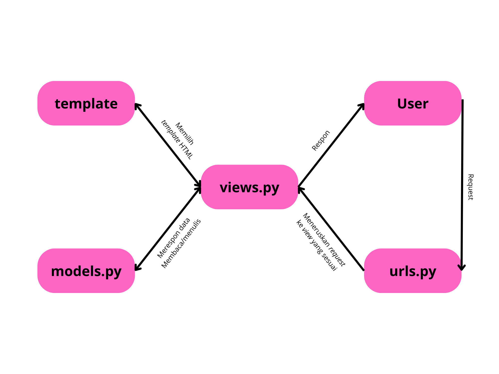

# Welcome to Mojo Dojo Casa House 🕺🏻💃🏻


## Tugas 2
### Cara _Step by Step_ Mengimplementasikan _Checklist_ 
1. Membuat repositori baru dengan nama ```Mojo Dojo Casa House```
2. Menghubungkan repositori lokal dengan repositori di GitHub
3. Melakukan _cloning_ repositori tersebut ke komputer lokal
4. Membuat _virtual environment_ Python dengan perintah:
    ```bash
    python3 -m venv env
    ```
5. Mengaktifkan _virtual environment_ Python baru dengan perintah:
    ```bash
    source env/bin/activate
    ```
6. Membuat file ```requirements.txt``` dengan menambahkan beberapa _depedencies_
    ```
    django
    gunicorn
    whitenoise
    psycopg2-binary
    requests
    urllib3
    ```
7. Menginstalasi _dependencies_ dengan pip
    ```bash
    pip install -r requirements.txt
    ```
8. Membuat proyek Django baru dengan perintah:
    ```bash
    django-admin startproject mojo_dojo_casa_house .
    ```
9. Mengubah ```ALLOWED_HOSTS``` di ```settings.py``` untuk keperluan deployment pada direktori ```mojo_dojo_casa_house```
    ```bash
    ...
    ALLOWED_HOSTS = ["localhost", "127.0.0.1"]
    ...
    ```
10. Membuat aplikasi baru dengan nama ```main``` dengan perintah:
    ```python
    python manage.py startapp main
    ```
11. Mendaftarkan aplikasi ```main``` ke dalam ```setting.py```
    ```
    INSTALLED_APPS = [
    ...,
    'main'
    ]
    ```
12. Mengisi berkas ```models.py``` pada direktori aplikasi ```main`` dengan kode:
    ```python
    from django.db import models

    class Product(models.Model):
        name = models.CharField(max_length=255)
        price = models.IntegerField()
        description = models.TextField()
        quantity = models.IntegerField()
    ```
13. Melakukan migrasi dengan perintah:
    ```python
    python manage.py makemigrations
    python manage.py migrate
    ```
14. Membuat direktori template dan template ```main.html``` 
    ```html
    <h1>Mojo Dojo Casa House 🕺🏻💃🏻</h1>

    <h3>Welcome to our online shop! </h3>
    <p>Username: {{ name }}</p>
    <p>Class: {{ class }}</p>
    ```
15. Menambahkan fungsi pada berkas ```views.py```:
    ```python
    from django.shortcuts import render

    def show_main(request):
        context = {
            'name' : 'Joanne',
            'class' : 'PBP C'
        }

        return render(request, "main.html", context)
    ```
16. Melakukan _routing_ URL di dalam direktori ```main``` dengan membuat berkas ```urls.py``` yang isinya:
    ```python
    from django.urls import path
    from main.views import show_main

    app_name = 'main'

    urlpatterns = [
        path('', show_main, name='show_main'),
    ]
    ```
17. Melakukan tes aplikasi pada localhost dengan perintah:
    ```python
    python3 manage.py runserver
    ```
18. Lalu buka ```http://localhost:8000``` untuk melihat aplikasi pada _browser_
19. Melakukan _deploy app_ ke situs Pacil Web Server (PWS)

### Bagan _Request Client_ ke _Web_ Aplikasi berbasis Django


_Request_ dari pengguna akan diproses terlebih dahulu sebelum diteruskan ke View yang tepat. View tersebut kemudian akan mengakses atau memodifikasi data di Model dan menggunakan Template untuk menampilkan dan mengirimkan respons kembali ke pengguna.

### Fungsi ```git``` dalam Pengembangan Perangkat Lunak
1. Mencatat semua perubahan kode, memungkinkan _developer_ melihat riwayat modifikasi dan siapa yang melakukan perubahan.
2. Memungkinkan banyak _developer_ bekerja secara bersamaan di cabang berbeda tanpa konflik, dengan kemampuan menggabungkan hasil kerja menggunakan _merge_.
3. Memfasilitasi pengelolaan versi perangkat lunak sehingga pengembang dapat beralih antar versi atau mengembalikan kode ke versi sebelumnya.
4. Menyimpan proyek dalam repositori yang dapat diakses lokal atau melalui server, seperti GitHub, untuk pembaruan atau pengunduhan kode.
5. Mendukung integrasi berkelanjutan dengan memudahkan ```pull```, ```commit```, dan ```push``` perubahan serta pengujian otomatis.

### Alasan Mengapa Framework Django Dijadikan Permulaan Pembelajaran PengembanganPperangkat Lunak
1. Tersedia banyak fitur bawaan sehingga pemula bisa langsung fokus pada pengembangan (seperti autentikasi, routing URL, dan pengelolaan database).
2. Terdapat pola arsitektur _Model View Template_ (MVT) yang memudahkan pemahaman pemisahan logika, tampilan, dan data.
3. Memiliki dokumentasi lengkap yang mudah diikuti oleh pemula.
4. Mendorong _clean code writing_ yang terstruktur, membantu membangun kebiasaan pengembangan yang baik.
5. Memiliki banyak pengguna dan komunitas sehingga dapat mendukung pemula dalam belajar dan menemukan solusi.

### Alasan Model pada Django disebut ORM
Disebut sebagai _Object-Relational Mapping_ (ORM) karena ORM memungkinkan kita untuk menghubungkan objek Python dengan tabel di database. Dengan ORM, kita dapat membuat, membaca, memperbarui, dan menghapus data di database tanpa menulis _query_ SQL secara langsung. 

Misalnya, setiap model di Django mewakili tabel dalam _database_, dan setiap atribut model mewakili kolom dalam tabel tersebut. ORM juga memudahkan pengelolaan relasi antar tabel dan perubahan skema database dengan sistem migrasi otomatis.